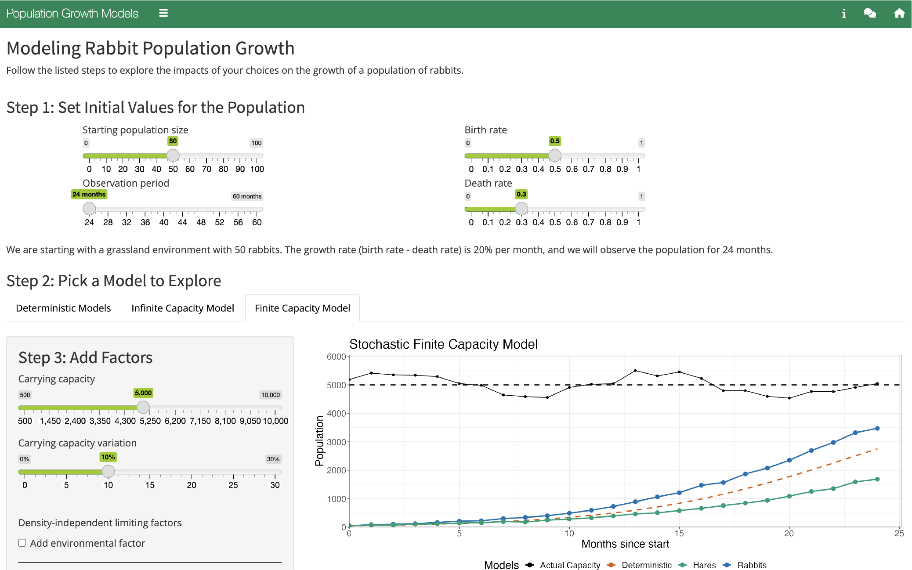

# Population Growth Models

# App Description
This app explores how growth rate, carrying capacity, density-independent limiting factors, and density-dependent limiting factors, affects the growth and variability of a hypothetical population of rabbits.